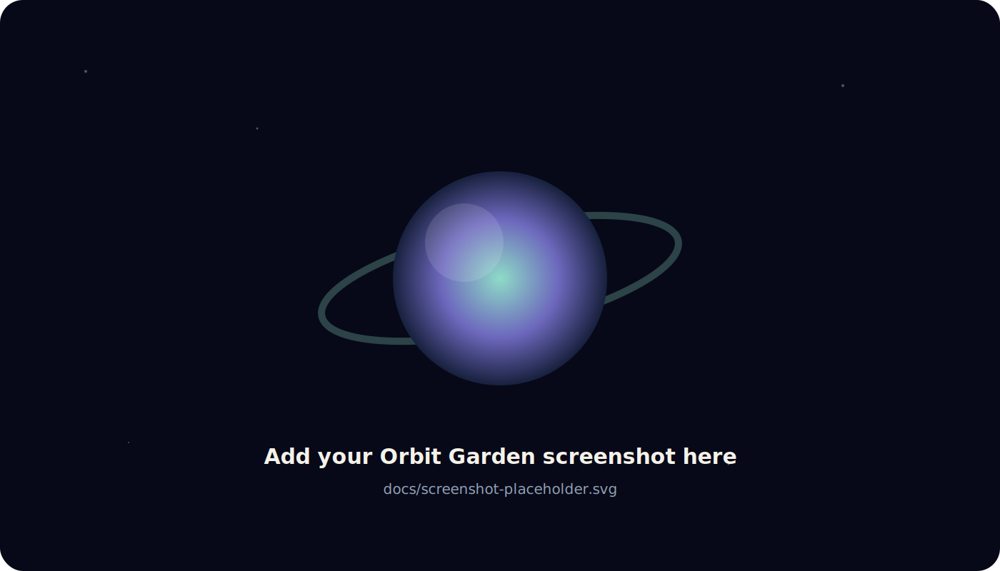

# Orbit Garden

> Grow a universe, one focused moment at a time.

Orbit Garden is a cozy, gamified focus timer where every completed session becomes a procedurally generated planet. Longer sessions can discover larger and more detailed worlds, while the task category shapes each planet's palette and surface style. Your galaxy, history, notes, statistics, and achievements stay private in your browser.

**Live demo:** _Coming soon — the project is ready to import into Vercel._

## Mobile app

The repository also contains the full Expo/React Native academic planner,
evidence-guided study timer, and reward garden described in the latest project
brief. See [`mobile/README.md`](mobile/README.md) for Expo Go setup, architecture,
research notes, testing, privacy, and EAS build instructions.

## Screenshot



After deploying, replace `docs/screenshot-placeholder.svg` with a full-width screenshot of the landing page or demo galaxy and update this image path.

## Features

- A polished public landing page with a procedural starfield and animated planet
- 5, 15, 25, 45, and 60-minute presets plus custom durations
- Start, pause, resume, cancel, refresh recovery, and a 10-second demo session
- Deterministic planet generation from a saved seed
- Category-based palettes for School, Coding, Reading, Creative, Exercise, and Personal sessions
- Layered SVG worlds with textures, craters, continents, bands, rings, moons, glow, vegetation, and auroras
- A dramatic planet reveal with name, rarity, traits, and session details
- An animated orbital galaxy and a mobile-friendly planet grid
- Planet memories, editable notes, and deletion confirmation
- A separate six-world demo galaxy
- Local dashboard with focus totals, streaks, category breakdown, weekly chart, recent missions, and rarest discovery
- Six gentle achievements with no stressful ranking or manipulative streak pressure
- Versioned `localStorage` with safe corruption fallback
- Keyboard focus states, semantic controls, useful ARIA labels, and reduced-motion support
- Direct-route support for Vercel

## How it works

1. Name a mission, choose a category, and select a comfortable duration.
2. Focus with the calm countdown and growing-world animation. The active timer is saved so an accidental refresh does not erase it.
3. When time finishes, Orbit Garden creates a planet from a deterministic seed based on the session.
4. Add the discovery to your garden, revisit its session story, write a note, and watch your universe grow.

Longer sessions increase visual complexity and the chance of unusual traits, but the app deliberately avoids rewarding unhealthy focus lengths. A 45 or 60-minute session is enough to reach the highest complexity range.

## Tech stack

- React 18 and TypeScript
- Vite
- Tailwind CSS
- Framer Motion
- Lucide React
- Hand-built procedural SVG art
- Browser `localStorage`
- Vitest and Testing Library

## Local setup

You need Node.js 20 or newer.

```bash
git clone <your-repository-url>
cd orbit-garden
npm install
npm run dev
```

Open the local URL printed by Vite. No API keys, account, database, or backend are required.

Quality checks:

```bash
npm run lint
npm run test
npm run build
```

## Project structure

```text
src/
├── components/       Reusable UI, planets, navigation, dialogs, and cards
├── data/             The isolated sample galaxy
├── hooks/            Garden state and persistence connection
├── lib/              Generation, storage, statistics, and achievements
├── pages/            Landing, focus, galaxy, and progress screens
├── tests/            Determinism, stats, achievements, and storage tests
└── types/            Shared TypeScript data structures
```

## Design decisions

- **SVG instead of image assets:** every planet is generated in code, stays crisp at any size, and does not depend on copyrighted artwork.
- **A saved seed:** the generator is random-looking but deterministic, so a planet never changes when it is revisited.
- **Local-first data:** the first version stays simple, private, free to run, and easy for another student to understand.
- **Demo data stays identified:** sample sessions are tagged and excluded from real statistics and achievements.
- **Calm gamification:** the app celebrates consistency without public scores, failure messages, or punishing lost streaks.

## What I learned

Building Orbit Garden taught me how to turn one data model into several connected experiences. A timer event becomes a session, a seed, an SVG planet, an orbit, a history record, a chart entry, and sometimes an achievement. I also learned that browser persistence needs careful parsing because even local data can become outdated or corrupted.

## Challenges

The most interesting challenge was making planets feel genuinely different without using image files. The renderer combines seeded palettes, gradients, clipped textures, surface features, rings, atmosphere, and moons. Another challenge was keeping orbit animation useful on desktop while changing to a clear card grid on smaller screens.

## Future ideas

- Optional ambient sound generated with the Web Audio API
- Import/export for moving a garden between devices
- More surface families and rare celestial events
- PWA installation and stronger offline caching
- A no-account share card that exports one planet as an image
- Optional focus/break cycles

## Deployment

The included `vercel.json` sends direct routes to `index.html` so React can render them instead of showing a 404.

In Vercel:

1. Choose **Add New → Project**.
2. Import the GitHub repository.
3. Keep framework preset **Vite**.
4. Use build command `npm run build`.
5. Use output directory `dist`.
6. Deploy, then replace the live-demo line at the top of this README with the production URL.

## Submission context

Orbit Garden was created as a Hack Club Sunbeam and Stardance project. I wanted to make something playful enough to feel like a small game, but practical enough that I would actually keep it open while doing homework, reading, or coding.

## Credits

Designed and built as a student project. Icons are from [Lucide](https://lucide.dev/). Typography uses DM Sans and Manrope from Google Fonts. All space artwork is generated by Orbit Garden's own SVG code.

## License

Released under the [MIT License](LICENSE).
